<div align="center">
  
</div>

<br />

<div align="center">
  
</div>

<br />

<div align="center">
  
</div>

<br />

<div align="center">
  
</div>

<br />

```text
SYSTEM / STACK

CORE    Java / Spring Boot / Spring MVC
DATA    MySQL / Redis / MyBatis-Plus
INFRA   Docker / Nginx / Linux
TOOLS   Git / Maven
```

[REPOSITORIES](https://github.com/afterinit?tab=repositories) / [PUBLIC ACTIVITY](https://github.com/afterinit?tab=overview)

<sub>PUBLIC GITHUB ACTIVITY · REFRESHED BY GITHUB ACTIONS · “ACTIVE” DESCRIBES RECENT GITHUB ACTIVITY, NOT LIVE PRESENCE</sub>
